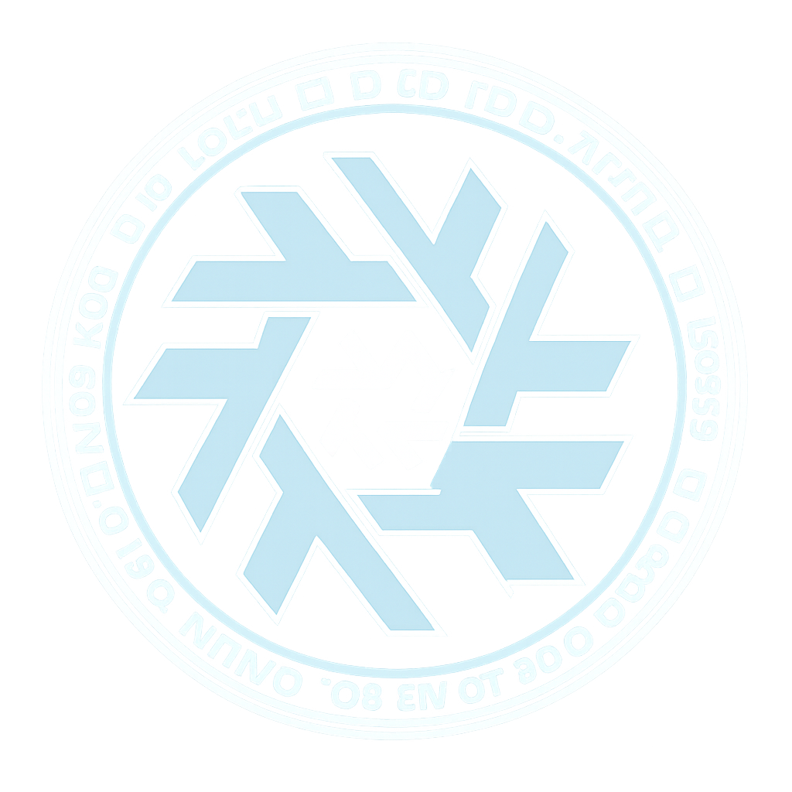

<h1 id="header" align="center">
    
    <br/>
    grimoire
</h1>


This is my personal grimoire full of declarative nix magic. It includes all configurations for my NixOS machines,
and my dotfiles managed through home-manager (for now). Deployment, management and secrets are handled through
[clan](https://clan.lol/).

# Infrastructure

My current machines are:

| Configuration                          | Type    | Location | Description        |
| -------------------------------------- | ------- | -------- | ------------------ |
| [Judradjim](./machines/judradjim/)     | Desktop | local    | My main desktop PC |
| [Zoltraak](./machines/zoltraak/)       | Server  | local    |                    |
| [Catastravia](./machines/catastravia/) | Server  | Hetzner  |                    |
| [Sorganeil](./machines/sorganeil/)     | Server  | local    | Raspberry PI 4     |

## Services

TODO

## Raspberry PI 4

First, download the latest sd-card image from [Hydra](https://hydra.nixos.org/job/nixos/trunk-combined/nixos.sd_image.aarch64-linux)
and extract the downloaded file.

```shell
wget https://hydra.nixos.org/build/334227370/download/1/nixos-image-sd-card-26.11pre1027867.d407951447dc-aarch64-linux.img.zst
unzstd -d nixos-image-sd-card-26.11pre1027867.d407951447dc-aarch64-linux.img.zst
```

Next, plugin the SD card and write the extracted file to it. This can be done using `dd` or a tool like balena etcher/caligula.

```shell
sudo dd if=nixos-image-sd-card-26.11pre1027867.d407951447dc-aarch64-linux.img of=/dev/sdX bs=4096 conv=fsync status=progress
```

Mount the SD card to add the public key

```shell
mkdir -p /home/nixos/.ssh
touch /home/nixos/.ssh/authorized_keys

# Ensure that the permissions are correct
chmod 700 /home/nixos/.ssh
chmod 600 /home/nixos/.ssh/authorized_keys

# Add the public key to the authorized_keys file
echo <SSH_PUB_KEY> > /home/nixos/.ssh/authorized_keys
```

Generate the `facter.json` file.

```bash
nix-shell -p nixos-facter --run 'sudo nixos-facter > facter.json'
```

Move the `facter.json` file to the correct location.

# Feature modules

Some of the config follows the Dendritic pattern.
As a result, these can be ran standalone. For example:

```shell
nix run .#myNiri 
```

# Credits

This configuration is inspired by and borrows from:

- [NotAShelf/nyx](https://github.com/NotAShelf/nyx)
- [Misterio77/nix-config](https://github.com/Misterio77/nix-config/tree/main)
- [niksingh710/ndots](https://github.com/niksingh710/ndots)
- [JManch/nixos](https://github.com/JManch/nixos)
- [notthebee/nix-config](https://git.notthebe.ee/notthebee/nix-config)
- [darkone-linux/darkone-nixos-framework](https://github.com/darkone-linux/darkone-nixos-framework)
- [pinpox/nixos](https://github.com/pinpox/nixos)
- [badele/nix-homelab](https://github.com/badele/nix-homelab)
