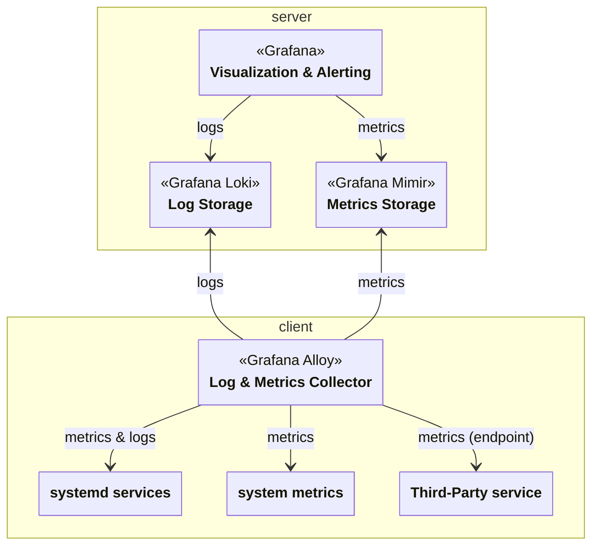

Monitoring service based on the clan.lol [monitoring service](https://git.clan.lol/clan/clan-core/src/branch/main/clanServices/monitoring).

## Inputs

The service collects `metric_endpoint` (name TBD) inputs from other clan services, allowing them to register their own metric endpoints.

## Architecture Overview

## Roles

### Server

The servers collect and store metrics and logs from the client machines.
They also provide Grafana dashboards for visualization and alerting.

### Client

Clients are machines that create metrics and logs.
